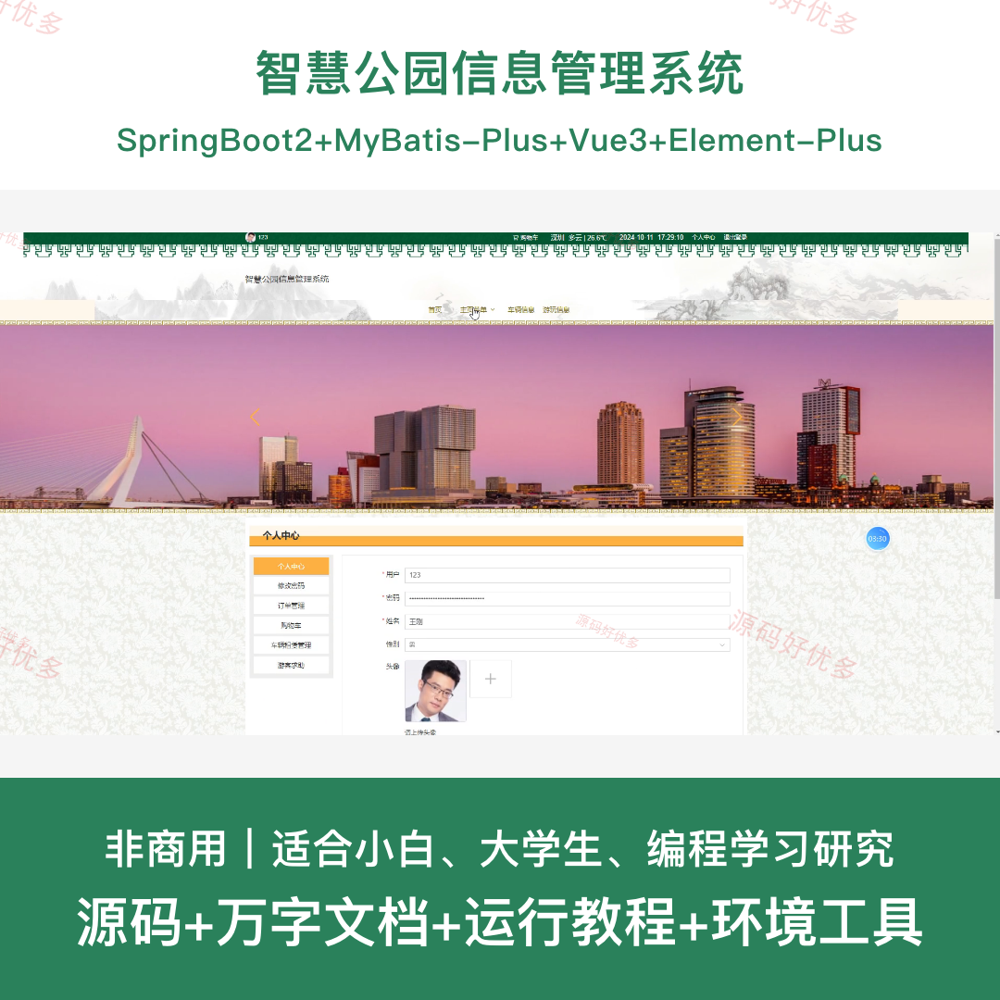
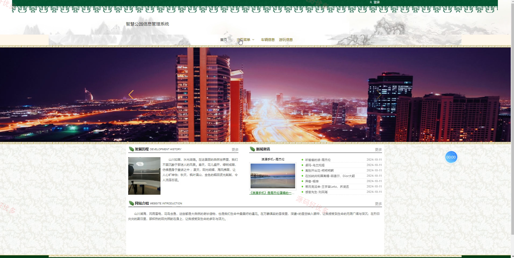
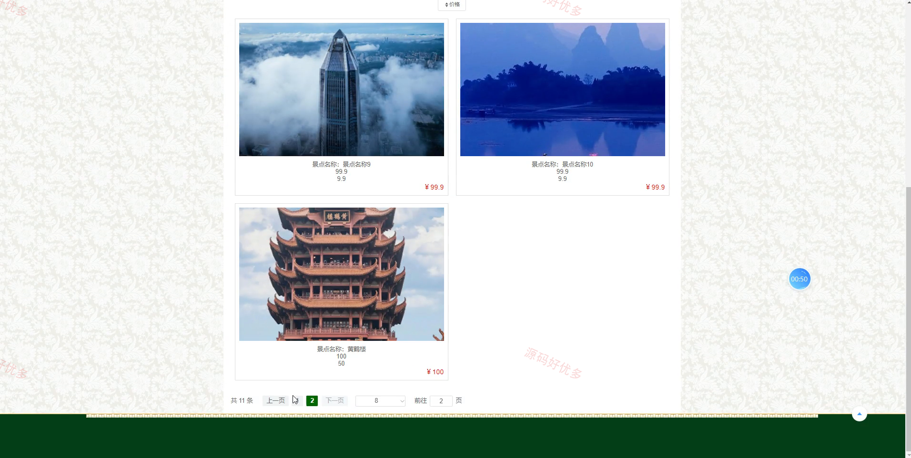
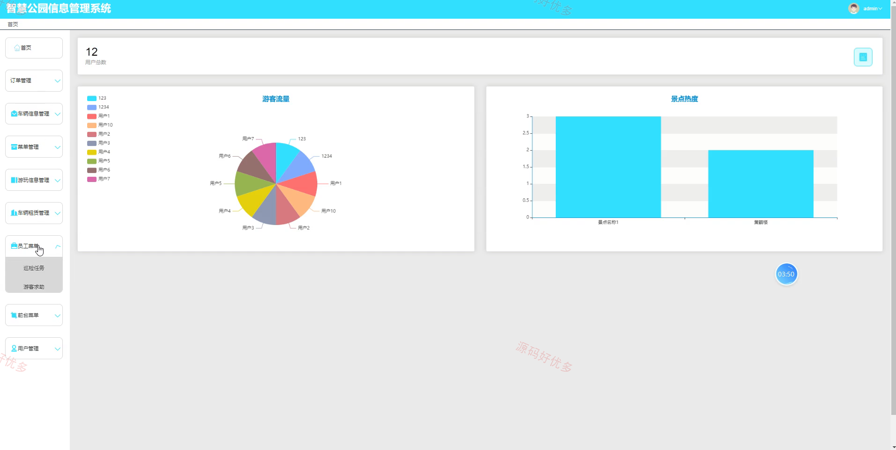
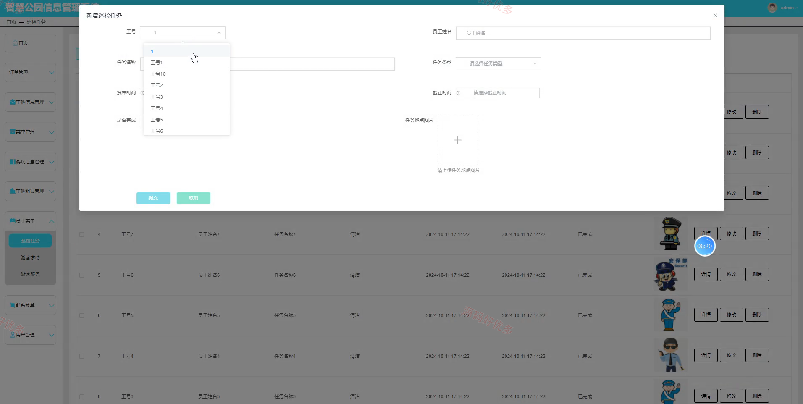
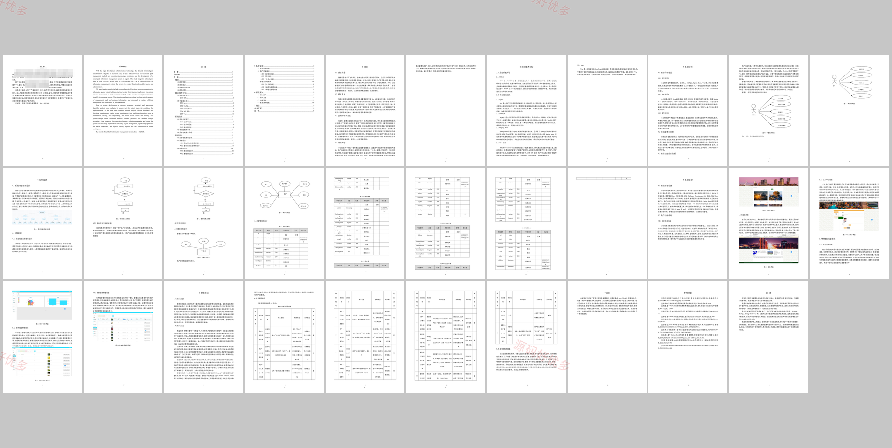

# springbootA559D
智慧公园信息管理系统
## 源码问题查看主页咨询

### 一、关键词
智慧公园、游玩信息、车辆租赁、游客服务、巡检任务

### 二、作品包含
源码+数据库+万字设计文档+全套环境和工具资源+本地部署教程

### 三、项目技术
前端技术： Html、Css、Js、Vue3.2、Element-Plus
后端技术：Java、SpringBoot2.2.2、MyBatis-Plus

### 四、运行环境（以下版本亲测，其他版本兼容性请自行测试）
开发工具：IDEA/eclipse + VSCODE

数据库：MySQL5.7+（共20张表）

数据库管理工具：Navicat10以上版本

环境配置软件： JDK1.8 + Maven3.6.3

前端Nodejs：16+

浏览器：谷歌浏览器

### 五、项目介绍
项目编号：springbootA559D

智慧公园信息管理系统面向公园游客和工作人员，提供游玩信息浏览、车辆租赁归还、游客求助、服务处理、巡检任务和后台数据维护等功能，提升公园运营与游客服务管理效率。

角色：管理员、用户、工作人员

用户功能：用户注册登录、游玩信息浏览、车辆租赁归还、游客求助提交、留言反馈、个人订单查看。

管理员功能：用户管理、工作人员管理、游玩信息管理、车辆信息管理、巡检任务管理、游客服务处理、订单统计维护。

### 六、运行截图

